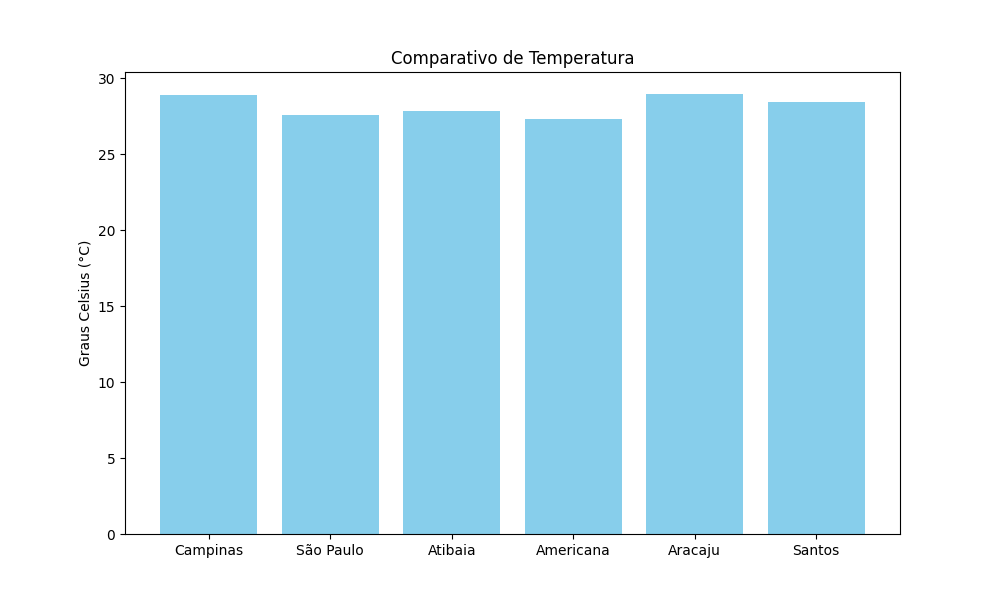

# Pipeline ETL de Monitoramento Climático

Este projeto implementa conhecimentos adquiridos sobre pipeline de dados, onde é extraído informações climáticas em tempo real utilizando uma API externa da OpenWeatherMap, transformando os dados brutos obtidos em um DataFrame e logo em seguida os armazena de forma estruturada no banco de dados SQLite.
No arquivo visualizar.py foi inserido um script para a leitura do banco de dados e formação de um gráfico comparativo sobre as temperatudas das cidades informadas. 

# Como executar
1. Clone este repositório.
2. Crie um arquivo .env baseado no .env.example e insira sua chave da API.
3. Execute o script:
   ```bash
   python temperatura.py

### Visualização dos Dados Coletados

